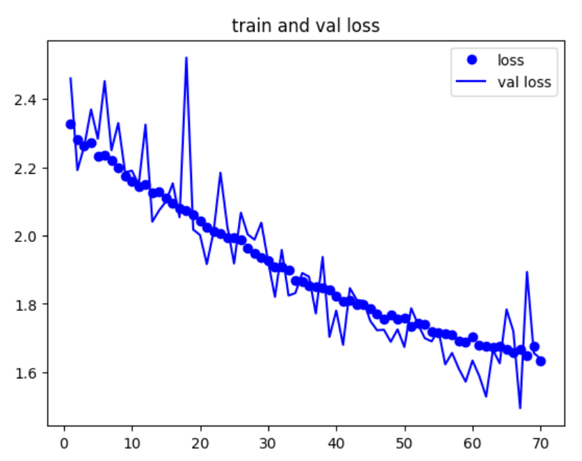

# **Project**: CNNs DL on Cards game image datset

## **Features**:

- DeepLearning
- CNNs
- kaggle
- Computer Vision

## **Overview**:

- The main code is in ``src.ipynb``
- In ``Building_data_structure.py`` and ``Building_data_structure.ipynb`` I built the Data structure:
    - 

- You can download the Dataset from this <a href='https://www.kaggle.com/datasets/gpiosenka/cards-image-datasetclassification'>Link</a> in kaggle.

- I built my own model architecture and haven`t used pretrained models.

## Loss and Accuracy Plots:

- 

- 
 
